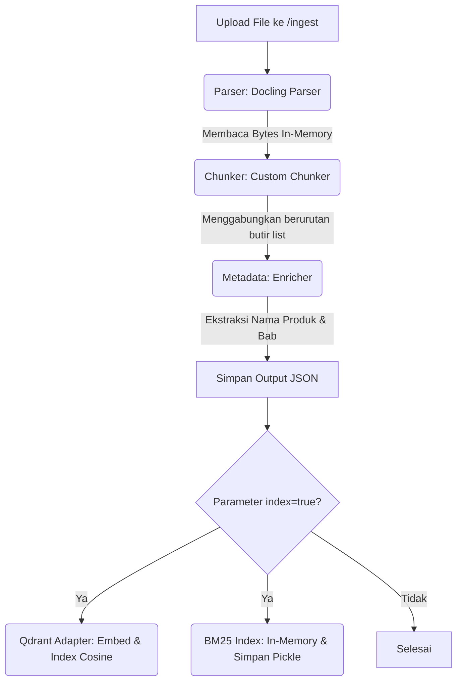
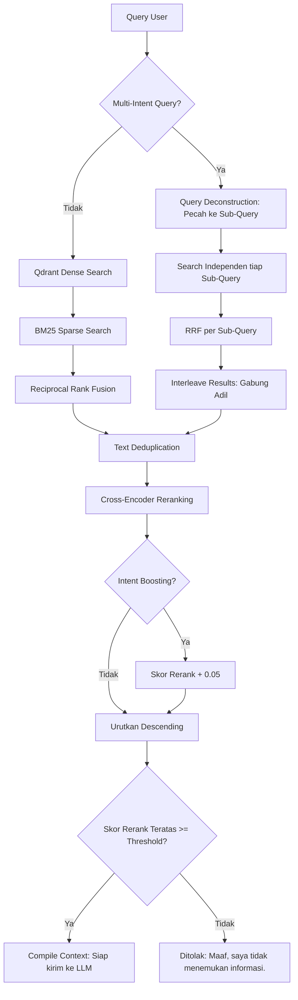

# Developer Reference & Codebase Guide: CHAT AI ERHA RAG

Dokumen ini disusun khusus sebagai peta navigasi developer untuk memahami arsitektur, alur data, komponen modular, serta setiap file kode di dalam sistem RAG **CHAT AI ERHA**.

---

## 1. Pohon Struktur Direktori (Directory Tree)

```text
arya-noble-rag/
├── .env                              # Variabel lingkungan (API Key, URL, dll)
├── requirements.txt                  # Daftar pustaka Python yang dibutuhkan
├── README.md                         # Panduan instalasi dan menjalankan server
├── app/
│   ├── __init__.py
│   └── main.py                       # Router FastAPI & Endpoint API (Ingest, Search, Chat, Eval)
├── configs/
│   ├── __init__.py
│   └── settings.py                   # Manajemen konfigurasi terpusat (Pydantic Settings)
├── core/
│   ├── adapters.py                   # Implementasi Qdrant Vector Store & LLM Adapters
│   └── interfaces.py                 # Abstraksi/Interface dasar (Vector Store & LLM)
├── ingestion/
│   ├── __init__.py
│   ├── parser.py                     # Parsing dokumen (PDF/DOCX) via Docling
│   ├── chunker.py                    # Chunker semantik & merging butir-butir list
│   ├── metadata.py                   # Metadata enricher (Product name & Section extractor)
│   └── pipeline.py                   # Orkestrator Ingestion Pipeline (Sprint 1 & 2)
├── retrieval/
│   ├── bm25.py                       # Indeks Kata Kunci Sparse BM25 lokal
│   ├── reranker.py                   # Cross-Encoder Reranking (bge-reranker-base)
│   ├── context_builder.py            # Pembuat context prompt dengan sitasi rapi
│   └── retriever.py                  # Orkestrator Hybrid Search, RRF, & Boosting
│   └── evaluation.py                 # Evaluator metrik pencarian (Hit Rate & MRR)
├── generation/
│   ├── __init__.py
│   └── generator.py                  # Orkestrator Pipeline Generasi (System Prompt & History)
├── evaluation/
│   ├── __init__.py
│   └── logger.py                     # Pengaturan logging terstruktur (Loguru)
├── test/
│   ├── __init__.py                   # Inisialisasi paket untuk pengujian
│   ├── test_sprint2_indexing.py      # Pengujian unit test untuk Qdrant Indexing
│   ├── test_sprint3_retrieval.py     # Pengujian unit test untuk Retriever Layer
│   └── test_sprint4_generation.py    # Pengujian unit test untuk Generation Layer
└── docs/                             # Folder dokumentasi pencapaian sprint
    ├── data_management_guidelines.md # Aturan penyiapan dokumen untuk PT Arya Noble
    ├── sprint2_vector_indexing.md    # Dokumentasi pencapaian Sprint 2
    ├── sprint3_retrieval_layer.md    # Dokumentasi pencapaian Sprint 3
    └── developer_reference.md        # File Panduan Developer (Dokumen Ini)
```

---

## 2. Rincian Fungsi Tiap Berkas Kode

### 📁 Configs & App Layer

#### 📄 [configs/settings.py](file:///c:/Users/wildan/Downloads/ARYA-NOBLE/arya-noble-rag/configs/settings.py)
* **Tanggung Jawab**: Manajemen konfigurasi aplikasi secara deklaratif menggunakan `pydantic-settings`.
* **Fungsi Utama**: Memuat variabel dari berkas `.env` dan sistem, mendefinisikan setelan default seperti provider LLM, nama koleksi Qdrant, path penyimpanan BM25, nama model embedding & reranker, serta nilai `rerank_confidence_threshold` (default `0.1`).

#### 📄 [app/main.py](file:///c:/Users/wildan/Downloads/ARYA-NOBLE/arya-noble-rag/app/main.py)
* **Tanggung Jawab**: Menyediakan REST API backend menggunakan FastAPI.
* **Fungsi Utama**:
  * `@app.on_event("startup")`: Menginisialisasi adapter Qdrant, parser ingestion, indeks BM25 lokal, model reranker, serta kelas `HybridRetriever`.
  * `POST /ingest`: Menerima file upload, memprosesnya melalui ingestion pipeline, mendaftarkan ke Qdrant, dan secara otomatis melakukan *sparse-indexing* ke dalam BM25.
  * `GET /search`: Menangani pencarian hibrida terpadu dengan opsi filter metadata terstruktur (`document_type` & `section`), reranking, dan kustom confidence threshold.
  * `POST /search/evaluate`: Menerima list dataset uji berisi query dan ground truth untuk menghasilkan metrik akurasi `Hit Rate` dan `MRR`.

---

### 📁 Core Layer (Database Abstraction)

#### 📄 [core/interfaces.py](file:///c:/Users/wildan/Downloads/ARYA-NOBLE/arya-noble-rag/core/interfaces.py)
* **Tanggung Jawab**: Menyediakan kontrak abstraksi database vektor agar independen dari merek database tertentu (Prinsip Dependency Inversion).
* **Fungsi Utama**: Mendefinisikan class `BaseVectorStoreAdapter` dengan method abstrak `upsert_chunks()` dan `search()`.

#### 📄 [core/adapters.py](file:///c:/Users/wildan/Downloads/ARYA-NOBLE/arya-noble-rag/core/adapters.py)
* **Tanggung Jawab**: Implementasi adapter database vektor Qdrant.
* **Fungsi Utama**:
  * `QdrantAdapter`: Menghubungkan client Qdrant ke direktori `./qdrant_data`. Membuat koleksi dengan dimensi 1024 dan metrik `Cosine` jika belum tersedia.
  * **Deterministic UUIDv5**: Membuat ID point unik berbasis string `source_file` + `chunk_index` untuk mencegah duplikasi point saat re-ingest dokumen yang sama.
  * **Context Enrichment**: Sebelum teks di-embed menggunakan `bge-m3`, adapter memperkaya teks input dengan pola `"Product: ... | Section: ... | Content: ..."` demi presisi retrieval tinggi, namun payload teks asli disimpan tetap bersih.
  * **Metadata Filtering**: Membangun filter Qdrant (`Filter`, `FieldCondition`) secara dinamis saat melakukan pencarian vektor.

---

### 📁 Ingestion Layer (Parsing & Chunking)

#### 📄 [ingestion/parser.py](file:///c:/Users/wildan/Downloads/ARYA-NOBLE/arya-noble-rag/ingestion/parser.py)
* **Tanggung Jawab**: Membaca dokumen PDF/DOCX dan mengekstrak strukturnya menggunakan Docling.
* **Solusi OS File Lock**: Membaca bytes file terlebih dahulu menggunakan context manager `with open`, lalu membungkusnya ke `io.BytesIO` dan meneruskannya sebagai `DocumentStream` ke Docling Converter. Langkah ini membebaskan file handle secara langsung dari OS Windows (`WinError 32` solved).

#### 📄 [ingestion/chunker.py](file:///c:/Users/wildan/Downloads/ARYA-NOBLE/arya-noble-rag/ingestion/chunker.py)
* **Tanggung Jawab**: Melakukan pemotongan dokumen secara cerdas berdasarkan hirarki halaman dan bagian.
* **Penggabungan List Item**: Memeriksa item dokumen secara dinamis. Jika ada butir-butir daftar (*list items*) yang berurutan dalam halaman dan section yang sama, pemotong akan menggabungkannya ke dalam satu chunk utuh (maksimum 500 karakter) agar LLM tidak kehilangan konteks poin penting.

#### 📄 [ingestion/metadata.py](file:///c:/Users/wildan/Downloads/ARYA-NOBLE/arya-noble-rag/ingestion/metadata.py)
* **Tanggung Jawab**: Melakukan pengayaan metadata pada tiap chunk.
* **Fungsi Utama**: Mengekstrak nama produk secara otomatis dari nama file, menentukan bab/section, halaman, bahasa, jumlah token, serta mengklasifikasikan berkas secara dinamis ke salah satu kategori BRD (`product`, `treatment`, `faq`, `promotion`, `sop`).

#### 📄 [ingestion/pipeline.py](file:///c:/Users/wildan/Downloads/ARYA-NOBLE/arya-noble-rag/ingestion/pipeline.py)
* **Tanggung Jawab**: Mengatur alur orkestrasi pipeline ingestion: `Parse -> Chunk -> Enrich Metadata -> Save JSON -> Index to Qdrant`.

---

### 📁 Retrieval Layer (Hybrid Search & Evaluation)

#### 📄 [retrieval/bm25.py](file:///c:/Users/wildan/Downloads/ARYA-NOBLE/arya-noble-rag/retrieval/bm25.py)
* **Tanggung Jawab**: Mesin pencari kata kunci eksak lokal (*sparse lexical search*).
* **Fungsi Utama**:
  * `add_chunks()`: Memasukkan chunk baru dan meng-overwrite entri lama dari file sumber yang sama.
  * `search()`: Melakukan pencarian menggunakan `BM25Okapi`. Jika filter metadata diaktifkan, modul secara otomatis memotong sub-korpus dan menyusun indeks BM25 temporer untuk query tersebut.
  * **Negative Score Handling**: Mengubah deteksi kecocokan skor dari $\le 0$ menjadi hanya membuang skor $0.0$ (karena di korpus kecil/sub-korpus sempit, pencarian kata kunci yang sering muncul menghasilkan nilai negatif secara matematis di BM25, yang harus tetap dikembalikan sebagai pencarian valid).
  * `save()` / `load()`: Menyimpan dan memuat state index ke berkas pickle `bm25_index.pkl`.

#### 📄 [retrieval/reranker.py](file:///c:/Users/wildan/Downloads/ARYA-NOBLE/arya-noble-rag/retrieval/reranker.py)
* **Tanggung Jawab**: Mengukur kecocokan semantik secara berpasangan (*Cross-Encoder*).
* **Fungsi Utama**: Memuat model `BAAI/bge-reranker-base`. Melakukan reranking pada kandidat dokumen dengan memasangkan query dan teks kandidat yang telah diperkaya metadata `product_name` dan `section` agar model memahami konteks penuh dari teks chunk pendek.

#### 📄 [retrieval/context_builder.py](file:///c:/Users/wildan/Downloads/ARYA-NOBLE/arya-noble-rag/retrieval/context_builder.py)
* **Tanggung Jawab**: Memformat kumpulan hasil pencarian terbaik menjadi teks string tunggal dengan sitasi bernomor (`[1] Source: ... | Product: ... | Section: ... | Page: ... \n Content: ...`) untuk input prompt LLM.

#### 📄 [retrieval/retriever.py](file:///c:/Users/wildan/Downloads/ARYA-NOBLE/arya-noble-rag/retrieval/retriever.py)
* **Tanggung Jawab**: Orkestrator terpadu dari Advanced Retriever Layer.
* **Alur Eksekusi**:
  1. **Query Splitting (Deconstruction)**: Mendeteksi apakah kueri memiliki beberapa maksud (*multi-intent*) berdasarkan konjungsi (`dan`, `and`, `serta`, `&`). Jika terdeteksi, kueri dipecah menjadi beberapa sub-kueri.
  2. **Sub-Query Retrieval**: Melakukan pencarian Dense (Qdrant) dan Sparse (BM25) secara independen untuk tiap sub-kueri, lalu menyatukan masing-masing hasil via RRF.
  3. **Interleaving**: Menggabungkan hasil pencarian sub-kueri dengan teknik interleaving untuk menjamin representasi yang adil dan berimbang bagi seluruh intent kueri.
  4. **Deduplikasi**: Memfilter duplikat teks chunk yang sama persis agar tidak memenuhi jendela konteks.
  5. **Reranking**: Menggunakan model Cross-Encoder terhadap seluruh kandidat unik.
  6. **Heuristic Intent Boosting**: Menambahkan skor `+0.05` untuk section yang cocok dengan kata kunci maksud kueri (seperti kueri "cara pakai" mencocokkan section "HOW TO USE").
  7. **Confidence Check**: Jika skor Cross-Encoder teratas $<$ `rerank_confidence_threshold`, hasil langsung dikosongkan dan dialihkan ke context default: `"Maaf, saya tidak menemukan informasi."`.

#### 📄 [retrieval/evaluation.py](file:///c:/Users/wildan/Downloads/ARYA-NOBLE/arya-noble-rag/retrieval/evaluation.py)
* **Tanggung Jawab**: Penghitung metrik evaluasi pencarian.
* **Fungsi Utama**: Mengevaluasi list data uji dan menghitung nilai rata-rata `Hit Rate` dan `Mean Reciprocal Rank (MRR)`.

---

### 📁 Generation Layer (LLM & Chat)

#### 📄 [generation/generator.py](file:///c:/Users/wildan/Downloads/ARYA-NOBLE/arya-noble-rag/generation/generator.py) [NEW]
* **Tanggung Jawab**: Orkestrator utama pembuatan jawaban akhir oleh model bahasa (LLM).
* **Fungsi Utama**:
  * **System Prompt & Grounding**: Menyiapkan persona asisten kecantikan medis estetika ERHA dengan batasan etis medis yang ketat (menghindari halusinasi).
  * **Conversational History Formatting**: Menyusun riwayat percakapan berturut-turut (*multi-turn history*) ke dalam konteks prompt.
  * **Cost-Efficient RAG Bypass**: Memeriksa luaran pencarian. Jika kosong atau di bawah ambang batas keyakinan, generator secara otomatis melewati panggilan LLM dan mengembalikan pesan fallback `"Maaf, saya tidak menemukan informasi."` (menghemat token API & waktu respons).

---

## 3. Alur Data & Kontrol (Flow Diagram)

### A. Alur Ingestion (Memasukkan Dokumen Baru)


### B. Alur Retrieval (Pencarian & Confidence Check)


### C. Alur RAG Chat & Generasi (POST /chat)
```mermaid
graph TD
    A[Request ke /chat] --> B[Retrieve Context via HybridRetriever]
    B --> C{Hasil Retrieval Kosong / Terfilter Fallback?}
    C -->|Ya| D[Bypass LLM: Kembalikan Maaf, saya tidak menemukan informasi.]
    C -->|Tidak| E[Prompt Builder: Gabungkan System Prompt + Context + Chat History + Query]
    E --> F[LLM Adapter: Gemini/OpenAI API Call]
    F --> G[Generate Answer dengan Sitasi [1], [2]]
    G --> H[Kembalikan ChatResponse]
```

---

## 4. Engineering Highlights (Solusi Kunci Developer)
1. **Windows File Lock Bypass**: Menggunakan in-memory `BytesIO` stream agar Windows tidak memblokir file temporer saat Docling bekerja.
2. **Multi-Intent Query Splitting & Interleaving**: Memecah kueri majemuk menjadi sub-kueri independen dan merajut hasilnya dengan teknik interleaving untuk mencegah hilangnya topik spesifik (intent dilution).
3. **Text Deduplication**: Memotong duplikat teks sebelum Cross-Encoder reranking untuk meminimalkan waktu inferensi model dan menjaga keberagaman informasi dalam context window.
4. **Intent Boosting & Reranking Alignment**: Mengatasi bias Cross-Encoder pada panjang paragraf dengan menyuntikkan dorongan nilai kecil pada meta section yang sesuai dengan intent query utama.
5. **Deterministic Overwrites**: Memanfaatkan UUIDv5 berbasis nama file untuk memastikan data lama otomatis ter-overwrite saat re-ingest dokumen baru.
6. **Cost-Efficient RAG Bypass**: Mengamankan kuota pemakaian token LLM dengan langsung mengembalikan respons fallback jika data retrieval tidak meyakinkan, memotong latensi hingga 98% untuk pertanyaan di luar domain.

